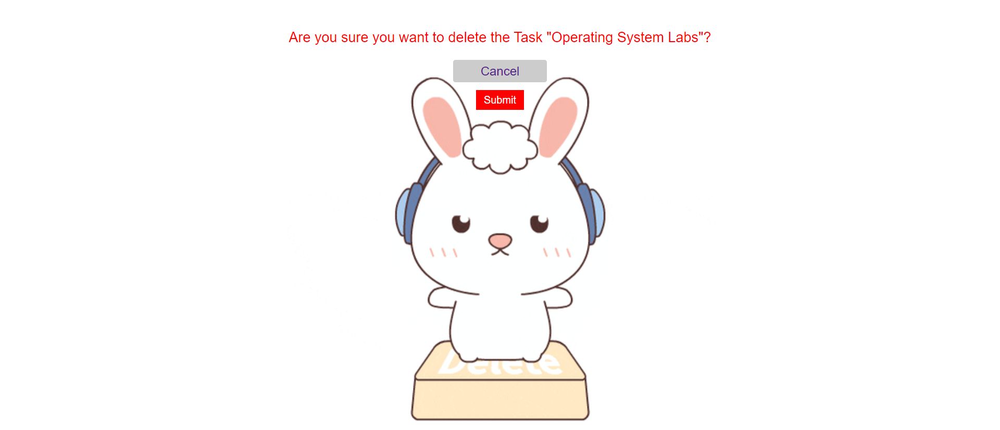

# Django ToDo App 

## Description
This is a simple ToDo web application built using Django framework. The app allows users to register, login, add tasks, delete tasks, mark tasks as done, and update tasks.

## Features
- User authentication (register, login)
- Create tasks
- Delete tasks
- Mark tasks as done
- Update tasks

## Installation
1. Clone this repository:
    ```bash
    git clone https://github.com/hamzamalik22/Django-Todo-app.git
    ```
2. Navigate to the project directory:
    ```bash
    cd todo
    ```
3. Install dependencies using pip:
    ```bash
    pip install -r requirements.txt
    ```

## Usage
1. Start the Django development server:
    ```bash
    python manage.py runserver
    ```
2. Open your web browser and go to [http://localhost:8000](http://localhost:8000) to access the application.

## Screenshots
- Login Page

- Register Page

- Tasks Page

- Update Page

- Delete Page


## Contributing
Contributions are welcome! If you want to contribute to this project, feel free to submit a pull request.

## License
This project is licensed under the MIT License - see the [LICENSE](LICENSE) file for details.